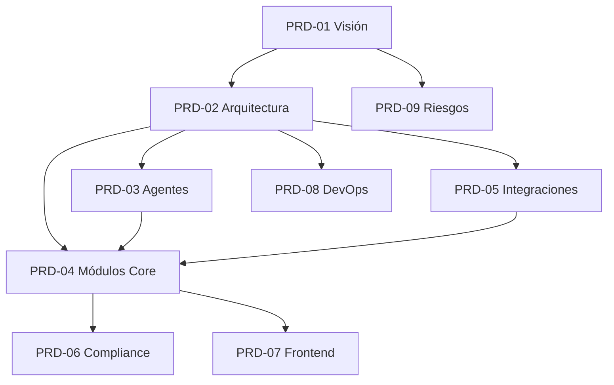

# 🏢 ConsorcIA — Map of Content

> **Plataforma de gestión de consorcios potenciada por IA.**  
> ERP de consorcio + Gestión personal del hogar + Benchmarking de costos.  
> Stack: NodeJS + React + Kimi3 Swarm + Nemotron + CheaperInference + AgentMail + Cerbos.

---

## 📊 Estado General del Proyecto

| Área | Estado | Última Actualización |
|------|--------|---------------------|
| Visión y Estrategia | ✅ Definido | 2026-07-26 |
| Arquitectura y Stack | ✅ Definido | 2026-07-26 |
| Agentes IA | ✅ Definido | 2026-07-26 |
| Módulos Core (MVP) | 🔄 En diseño | 2026-07-26 |
| Módulos Core (Fase 2) | ⏳ Pendiente | — |
| Integraciones | ✅ Definido | 2026-07-26 |
| Compliance | ✅ Definido | 2026-07-26 |
| Frontend y UX | ✅ Definido | 2026-07-26 |
| DevOps | ✅ Definido | 2026-07-26 |
| Benchmarking | ⏳ Fase 3 | — |

---

## 📁 Índice por Área

### 01 — Visión y Estrategia
- [[PRD-01-01 Visión del Producto]] — Propuesta de valor, mercado, diferenciadores
- [[PRD-01-02 Estrategia de MVP y Fases]] — Roadmap, priorización, go-to-market
- [[PRD-01-03 Modelo de Negocio]] — Pricing, monetización, proyecciones financieras
- [[PRD-01-04 Análisis Competitivo]] — Matriz comparativa, gaps, oportunidades

### 02 — Arquitectura y Stack
- [[PRD-02-01 Arquitectura General]] — Diagrama completo, capas, flujos
- [[PRD-02-02 Stack Tecnológico]] — Justificación de cada componente
- [[PRD-02-03 Infraestructura Docker]] — docker-compose, servicios, networking
- [[PRD-02-04 Base de Datos]] — Schema Prisma, pgvector, multi-tenancy por organización
- [[PRD-02-05 Motor Contable]] — Liquidación engine, decimal.js, validaciones
- [[PRD-02-06 Router LLM]] — CheaperInference + Nemotron + model tiering

### 03 — Agentes IA
- [[PRD-03-01 Arquitectura de Agentes]] — Swarm router, orquestación, patrones OpenWorker
- [[PRD-03-02 Agente Onboarding]] — Configuración de edificios y unidades
- [[PRD-03-03 Agente Contable]] — Wrapper del motor contable, explicaciones
- [[PRD-03-04 Agente Documental]] — OCR, parsing de PDFs, normalización
- [[PRD-03-05 Agente Comunicador]] — Emails, WhatsApp, RAG, comunicaciones
- [[PRD-03-06 Agente Cobranzas]] — Recordatorios, links de pago, conciliación
- [[PRD-03-07 Agente Kanban]] — Fase 2: clasificación, asignación, seguimiento
- [[PRD-03-08 Agente Dashboard]] — Fase 2: insights, anomalías, reportes
- [[PRD-03-09 Agente Benchmarking]] — Fase 3: comparativas, KPIs, anonimización

### 04 — Módulos Core
- [[PRD-04-01 Gestión de Edificios]] — Alta de edificios en la organización, tipologías, coeficientes, categorías A/B/C
- [[PRD-04-02 Gestor de Gastos]] — Carga, categorización, asignación
- [[PRD-04-03 Liquidación de Expensas]] — Motor contable, recibos, QR Ley 941
- [[PRD-04-04 Cobranzas]] — MercadoPago, QR, conciliación manual/automática
- [[PRD-04-05 Portal del Residente]] — Expensas, pagos, documentos, chat
- [[PRD-04-06 Kanban de Tareas]] — Fase 2: estados, flujo, comunicación integrada
- [[PRD-04-07 Importación Inteligente]] — Fase 2: OCR de PDFs, discovery, preview
- [[PRD-04-08 Dashboard Administrador]] — Fase 2: estadísticas, reportes, anomalías
- [[PRD-04-09 Gestión Personal del Hogar]] — Fase 3: costos de vivienda, impuestos
- [[PRD-04-10 Benchmarking]] — Fase 3: costos por m², KPIs comparativos

### 05 — Integraciones
- [[PRD-05-01 AgentMail]] — Emails programáticos, webhooks, labeling
- [[PRD-05-02 MercadoPago]] — Links de pago, QR, webhooks
- [[PRD-05-03 WhatsApp Business API]] — Notificaciones, chatbot
- [[PRD-05-04 Cerbos RBAC]] — Autorización como código, políticas YAML
- [[PRD-05-05 OCR Service]] — Unlimited-OCR microservicio Python
- [[PRD-05-06 Embeddings y RAG]] — Nemotron 3 Embed 1B, pgvector, semantic search

### 06 — Compliance y Legal
- [[PRD-06-01 Ley 941 CABA]] — Recibos, QR, matrícula RPA, separación ord/ext
- [[PRD-06-02 Ley 14.701 PBA]] — RPAC, DDJJ provincial
- [[PRD-06-03 Ley 25.326]] — Protección de datos personales
- [[PRD-06-04 Código Civil y Comercial]] — Arts. 2037-2072, consorcio como persona jurídica
- [[PRD-06-05 CCT 589/10 SUTERH]] — Sueldos de encargados

### 07 — Frontend y UX
- [[PRD-07-01 Stack Frontend]] — React 19, Vite, Tailwind, shadcn/ui
- [[PRD-07-02 Diseño de Componentes]] — Sistema de diseño, tokens, accesibilidad
- [[PRD-07-03 Rutas y Navegación]] — React Router, layouts, guards
- [[PRD-07-04 Estado Global]] — Zustand, TanStack Query, optimistic updates
- [[PRD-07-05 App Móvil]] — Fase 2: React Native, notificaciones push

### 08 — DevOps y Observabilidad
- [[PRD-08-01 Docker Compose Local]] — ⚠️ Obsoleto (variante anterior; el canónico es [[PRD-02-03 Infraestructura Docker]])
- [[PRD-08-02 CI/CD]] — GitHub Actions, Docker Hub
- [[PRD-08-03 Deploy AWS]] — ECS/Fargate, RDS, ElastiCache, S3
- [[PRD-08-04 Monitoring]] — OpenTelemetry, Jaeger, Prometheus, Grafana
- [[PRD-08-05 Seguridad]] — JWT, RBAC, encriptación, audit logs

### 09 — Riesgos y Decisiones
- [[PRD-09-01 Decisiones de Arquitectura]] — ADRs, trade-offs, justificaciones
- [[PRD-09-02 Riesgos Técnicos]] — Mitigaciones, contingencias
- [[PRD-09-03 Riesgos de Negocio]] — Competencia, regulación, economía
- [[PRD-09-04 Riesgos de Compliance]] — Legal, datos, auditoría

### 10 — Referencias
- [[PRD-10-01 Glosario]] — Términos del dominio
- [[PRD-10-02 Recursos Externos]] — Links, documentación, APIs
- [[PRD-10-03 Changelog]] — Historial de cambios en PRDs

---

## 🔗 Dependencias Cruzadas

---

## 🏷️ Tags Principales

#consorcIA #mvp #fase2 #fase3 #agente #core #integracion #compliance #frontend #devops #riesgo #decision

---

## 📝 Notas para el Equipo

- **Cada PRD es autocontenido.** No asumas que el lector conoce otro documento.
- **Frontmatter obligatorio.** Todo PRD debe tener `title`, `status`, `priority`, `tags`, `outcomes`.
- **Decisiones de diseño:** Si cambiás algo, actualizá el PRD correspondiente Y el MOC.
- **Links bidireccionales:** Usá `[[PRD-XX-XX]]` para conectar documentos.
- **Estados:** `borrador` → `revisión` → `aprobado` → `vigente` → `obsoleto`

---

*Última actualización: 2026-07-26*  
*Versión del vault: 1.0.0*
